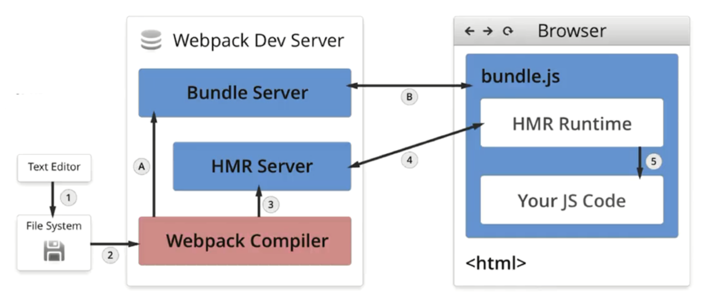

# 热编译

> 在开始前，我们先将 [`mode` 设置为 `'development'`](https://v4.webpack.docschina.org/concepts/mode/#mode-development)。

在每次编译代码时，手动运行 `npm run build` 会显得很麻烦，`webpack` 提供几种可选方式，帮助你在代码发生变化后自动编译代码：

1. `webpack watch mode`(`webpack` 观察模式)
2. `webpack-dev-server`
3. `webpack-dev-middleware`

## watch mode

你可以指示 ``webpack`` "``watch``" 依赖图中所有文件的更改。如果其中一个文件被更新，代码将被重新编译，所以你不必再去手动运行整个构建。

我们添加一个用于启动 ``webpack watch mode`` 的 ``npm scripts``：

```diff
{
    "name": "development",
    "version": "1.0.0",
    "description": "",
    "main": "webpack.config.js",
    "scripts": {
      "test": "echo \"Error: no test specified\" && exit 1",
+     "watch": "webpack --watch",
      "build": "webpack"
    },
  }
```

还可以在编译选项里添加：

```ts
module.export = {
    // 默认false,也就是不开启
    watch: true,
    // 只有开启监听模式时，watchOptions才有意义
    watchOptions: {
        // 默认为空，不监听的文件或者文件夹，支持正则匹配
        ignored: /node_modules/,
        // 监听到变化发生后会等300ms再去执行，默认300ms
        aggregateTimeout:300,
        // 判断文件是否发生变化是通过不停询问系统指定文件有没有变化实现的，默认每秒问1000次
        poll:1000
    }
}
```

### 原理

轮询判断文件的最后编辑时间是否变化，如果某个文件发生了变化，并不会立刻告诉监听者，而是先缓存起来，等 `aggregateTimeout` 后再执行编译。

唯一的缺点是，为了看到修改后的实际效果，你需要刷新浏览器。如果能够自动刷新浏览器就更好了，因此接下来我们会尝试通过 `webpack-dev-server` 实现此功能。


# 热更新

`Webpack` 的热更新又称热替换（`Hot Module Replacement`），缩写为 `HMR`。 这个机制可以做到不用刷新浏览器而将新变更的模块替换掉旧的模块。

`HMR`的核心就是客户端从服务端拉去更新后的文件，准确的说是 `chunk diff (chunk` 需要更新的部分)，实际上 `WDS` 与浏览器之间维护了一个 `Websocket`，当本地资源发生变化时，`WDS` 会向浏览器推送更新，并带上构建时的 `hash`，让客户端与上一次资源进行对比。

客户端对比出差异后会向 `WDS` 发起 `Ajax` 请求来获取更改内容(文件列表、`hash)`，这样客户端就可以再借助这些信息继续向 `WDS` 发起 `jsonp` 请求获取该`chunk`的增量更新。

## webpack-dev-server

`webpack-dev-server` 为你提供了一个简单的 `web server`，并且具有 `live reloading`(实时重新加载) 功能。设置如下：

```bash
npm install --save-dev webpack-dev-server
```

修改配置文件，设置 `dev server`根目录位置：

```diff
  const path = require('path');
  const HtmlWebpackPlugin = require('html-webpack-plugin');
  const CleanWebpackPlugin = require('clean-webpack-plugin');

  module.exports = {
    mode: 'development',
    entry: {
      app: './src/index.js',
      print: './src/print.js'
    },
    devtool: 'inline-source-map',
+   devServer: {
+     contentBase: './dist'
+   },
    plugins: [
      new CleanWebpackPlugin(['dist']),
      new HtmlWebpackPlugin({
        title: 'Development'
      })
    ],
    output: {
      filename: '[name].bundle.js',
      path: path.resolve(__dirname, 'dist')
    }
  };
```

以上配置告知 `webpack-dev-server`，将 `dist` 目录下的文件 serve 到 `localhost:8080` 下。

> webpack-dev-server 在编译之后不会写入到任何输出文件。而是将 bundle 文件保留在内存中，然后将它们 serve 到 server 中，就好像它们是挂载在 server 根路径上的真实文件一样。如果你的页面希望在其他不同路径中找到 bundle 文件，则可以通过 dev server 配置中的 [`publicPath`](https://v4.webpack.docschina.org/configuration/dev-server/#devserver-publicpath-) 选项进行修改。

我们添加一个可以直接运行 dev server 的 script：

**package.json**

```diff
  {
    "name": "development",
    "version": "1.0.0",
    "description": "",
    "main": "webpack.config.js",
    "scripts": {
      "test": "echo \"Error: no test specified\" && exit 1",
      "watch": "webpack --watch",
+     "start": "webpack-dev-server --open",
      "build": "webpack"
    }
  }
```

现在，在命令行中运行 `npm start`，我们会看到浏览器自动加载页面。如果你更改任何源文件并保存它们，web server 将在编译代码后自动重新加载。试试看！

### 原理

`webpackCompiler（webpack编译器）`编译文件之后，`buddule-server`提供一个目录的访问。`hmr-server`创建一个`websocket`，代码改变时，打包编译器通知`hmr-server`，`hmr-server`发送更新`json`给`hmr-rutime`，`runtime`进行实时更新。



### 配置拓展

#### `devServer.publicPath`

用于设置打包文件在浏览器中的访问前缀，假设服务器运行在 `http://localhost:8080` 并且 [`output.filename`](https://v4.webpack.docschina.org/configuration/output/#output-filename) 被设置为 `bundle.js`。默认 `devServer.publicPath` 是 `'/'`，所以你的包(bundle)可以通过 `http://localhost:8080/bundle.js` 访问。

修改 `devServer.publicPath`，将 bundle 放在指定目录下：

**webpack.config.js**

```javascript
module.exports = {
  //...
  devServer: {
    publicPath: '/assets/'
  }
};
```

现在可以通过 `http://localhost:8080/assets/bundle.js` 访问 bundle。

> 确保 `devServer.publicPath` 总是以斜杠(/)开头和结尾。

#### `devServer.port`

指定要监听请求的端口号：

**webpack.config.js**

```javascript
module.exports = {
  //...
  devServer: {
    port: 8080
  }
};
```

CLI 用法

```bash
webpack-dev-server --port 8080
```

#### `devServer.lazy` 🔑

当启用 `devServer.lazy` 时，dev-server 只有在请求时才编译包(bundle)。这意味着 webpack 不会监视任何文件改动。我们称之为**惰性模式**。

**webpack.config.js**

```javascript
module.exports = {
  //...
  devServer: {
    lazy: true
  }
};
```

#### `devServer.filename` 🔑

在 [lazy mode(惰性模式)](https://v4.webpack.docschina.org/configuration/dev-server/#devserver-lazy-) 中，此选项可减少编译。 默认在 [lazy mode(惰性模式)](https://v4.webpack.docschina.org/configuration/dev-server/#devserver-lazy-)，每个请求结果都会产生全新的编译。使用 `filename`，可以只在某个文件被请求时编译。

如果 [`output.filename`](https://v4.webpack.docschina.org/configuration/output/#output-filename) 设置为 `'bundle.js'` ，`devServer.filename` 用法如下：

**webpack.config.js**

```javascript
module.exports = {
  //...
  output: {
    filename: 'bundle.js'
  },
  devServer: {
    lazy: true,
    filename: 'bundle.js'
  }
};
```

现在只有在请求 `/bundle.js` 时候，才会编译 bundle。

#### `devServer.headers` 🔑

在所有响应中添加首部内容：

**webpack.config.js**

```javascript
module.exports = {
  //...
  devServer: {
    headers: {
      'X-Custom-Foo': 'bar'
    }
  }
};
```

#### `devServer.historyApiFallback`

当使用 [HTML5 History API](https://developer.mozilla.org/en-US/docs/Web/API/History) 时，任意的 `404` 响应都可能需要被替代为 `index.html`。`devServer.historyApiFallback` 默认禁用。通过传入以下启用：

**webpack.config.js**

```javascript
module.exports = {
  //...
  devServer: {
    historyApiFallback: true
  }
};
```

#### `devServer.hot`

启用 webpack 的 [模块热替换](https://v4.webpack.docschina.org/concepts/hot-module-replacement/) 功能：

**webpack.config.js**

```javascript
module.exports = {
  //...
  devServer: {
    hot: true
  }
};
```

> 注意，必须有 [`webpack.HotModuleReplacementPlugin`](https://v4.webpack.docschina.org/plugins/hot-module-replacement-plugin/) 才能完全启用 HMR。如果 `webpack` 或 `webpack-dev-server` 是通过 `--hot` 选项启动的，那么这个插件会被自动添加，所以你可能不需要把它添加到 `webpack.config.js` 中。关于更多信息，请查看 [HMR 概念](https://v4.webpack.docschina.org/concepts/hot-module-replacement/) 页面。