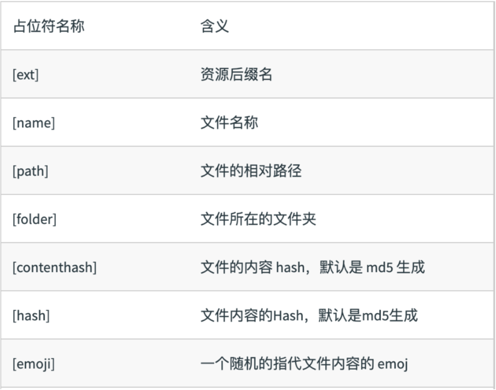

## 文件指纹

任何一个文件，无论是可执行程序、图像文件、临时文件或者其他任何类型的文件，也不管它体积多大，都有且只有一个独一无二的`MD5`信息值，并且如果这个文件被修改过，它的`MD5`值也将随之改变。因此，我们可以通过对比同一文件的`MD5`值，来校验这个文件是否被“篡改”过。

> 浏览器本地缓存更新，项目内容更新。

`webpack` 原生提供了三种文件指纹给我们：

+ **Hash：**和整个项⽬目的构建相关，只要项⽬目⽂文件有修改，整个项⽬目构建的`hash`值就会更更改，一般不会使用。
+ **Chunkhash：**和`webpack` 打包的`chunk` 有关，不不同的`entry` 会⽣生成不不同的`chunkhash`值，打包的入口文件的依赖中只要有一个文件发生了变化，就会改变，一般用于出口文件。
+ **Contenthash：**根据⽂件内容来定义hash ，文件内容不不变，则 `contenthash` 不不变，指的是文件的实际内容，一般用于图片和字体和样式等资源文件。

除了文件指纹方法之外，还有其他标识：



出口文件的 `hash` 处理：

```js
'use strict'

const path = require("path");

module.exports = {
    entry:{
        search:"./src/search.js",
        index:"./src/index.js"
    },
    output:{
        path:path.join(__dirname,'dist'),
        filename:'[name]_[chunkhash:8].js'
    },
    mode:"production"
};
```

图片和文字的 `hash` 处理：

```js
module.exports = {
    module:{
        rules: [{
                test:/\.(png|jpg|gif|jpeg)$/,
                use:[{
                        loader:"file-loader",
                        options:{
                            name:'[name]_[contenthash:8].[ext]'
                        }
                }]
            },
            {
                test:/\.(woff|woff2|eot|ttf|otf)$/,
                use:[{
                    loader:"file-loader",
                    options:{
                        name:'[name]_[contenthash:8].[ext]'
                    }
            }]
        }]
    }
};
```

`css` 文件 `hash` 处理：

```js
module.exports = {
    plugins: [
        new MiniCssExtractPlugin({
            filename:"[name]_[contenthash:8].css"
        })
    ]
};
```


