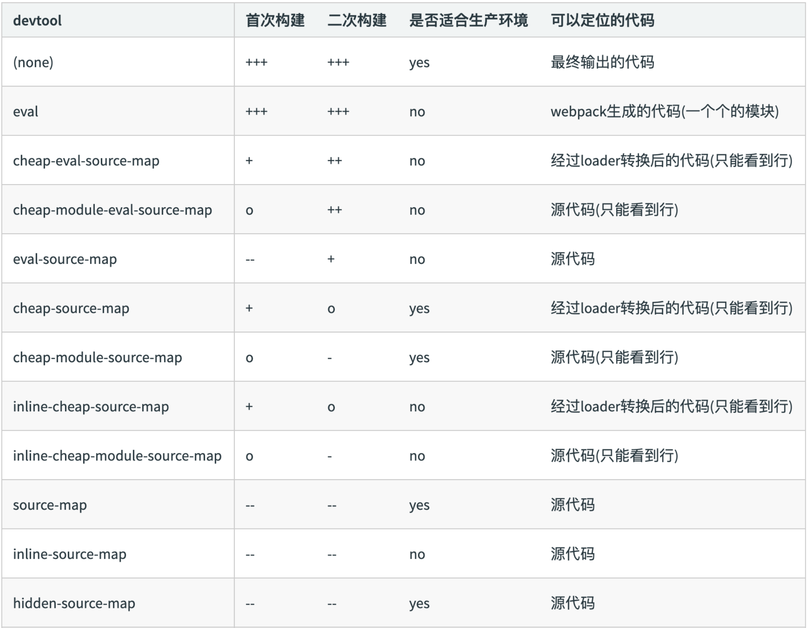

## Source Map

上周，[jQuery 1.9](http://blog.jquery.com/2013/01/15/jquery-1-9-final-jquery-2-0-beta-migrate-final-released/)发布。这是2.0版之前的最后一个新版本，有很多新功能，其中一个就是支持Source Map，访问 http://ajax.googleapis.com/ajax/libs/jquery/1.9.0/jquery.min.js，打开压缩后的版本，滚动到底部，你可以看到最后一行是这样的：

```js
//@ sourceMappingURL=jquery.min.map
```

这就是`Source Map`。它是一个独立的`map`文件，与源码在同一个目录下，你可以点击进去，看看它的样子。

#### 源码转换的问题

JavaScript脚本正变得越来越复杂。大部分源码（尤其是各种函数库和框架）都要经过转换，才能投入生产环境。

常见的源码转换，主要是以下三种情况：

+ 压缩，减小体积。比如`jQuery 1.9`的源码，压缩前是`252KB`，压缩后是`32KB`。
+ 多个文件合并，减少 `HTTP` 请求数。
+ 其他语言编译成 `JavaScript`。最常见的例子就是 `CoffeeScript`。

这三种情况，都使得实际运行的代码不同于开发代码，除错（`debug`）变得困难重重。通常，`JavaScript`的解释器会告诉你，第几行第几列代码出错。但是，这对于转换后的代码毫无用处。举例来说，`jQuery 1.9`压缩后只有`3`行，每行`3`万个字符，所有内部变量都改了名字。你看着报错信息，感到毫无头绪，根本不知道它所对应的原始位置。这就是`Source map`想要解决的问题。

#### 什么是Source map

简单说，`Source map`就是一个信息文件，里面储存着位置信息。也就是说，转换后的代码的每一个位置，所对应的转换前的位置。有了它，出错的时候，除错工具将直接显示原始代码，而不是转换后的代码。这无疑给开发者带来了很大方便。


目前，暂时只有`Chrome`浏览器支持这个功能。在`Developer Tools`的`Setting`设置中，确认选中"`Enable source maps`"。


#### 启用Source map

正如前文所提到的，只要在转换后的代码尾部，加上一行就可以了。

```js
//@ sourceMappingURL=/path/to/file.js.map
```

`map` 文件可以放在网络上，也可以放在本地文件系统。

## Webpack Source map

`webpack`的`sourcemap`是在开发环境下使用的，所以说你的`env`选项最好是`development`，然后再 `devtool` 关键字里面加上对应的`source`选项即可。

#### 关键字

+ `eval`：打包之后不生成.`map`文件，将文件用`eval`包裹放到编译好的入口文件中。
+ `source map`：生成.`map`文件。
+ `inline`：将。`map`文件使用`DataURL`嵌入，默认是不生成.`map`文件。
+ `cheap`：只包含列信息。
+ `module`:包含`loader`的`sourcemap`

#### 排列组合



#### 常用配置

```json
{
	devtool:'source-map'
    //打印入口文件源码
}
```

