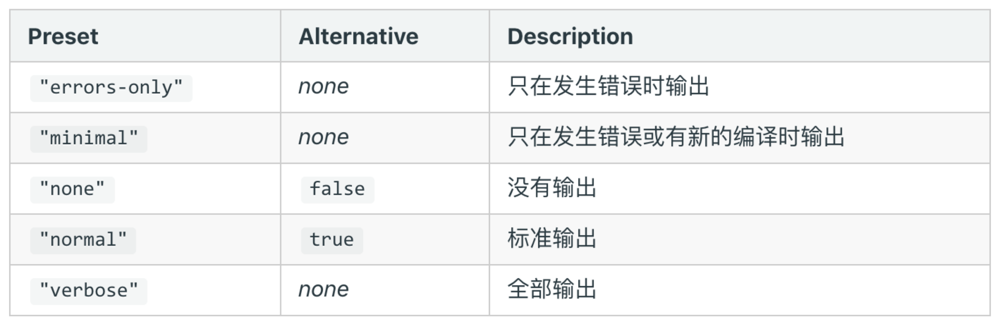
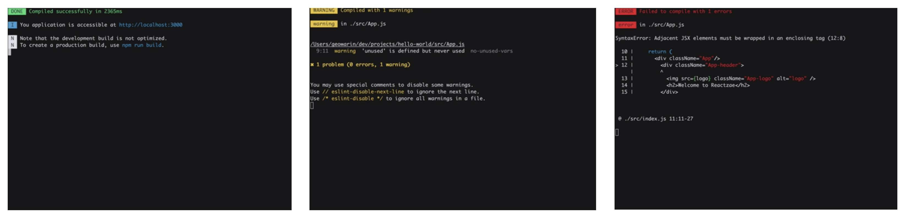

## 优化构建日志

通常`webpack`项目中控制台会打印很多没有用的信息，我们通常不需要一些插件的执行日志，我们关注的通常是报错和警告信息，这时我们就需要对构建日志进行优化。

### `state` 字段



生产环境下 `prod`：

```js
{
		plugins: [],
    state:"errors-only"
}
```

开发环境下 `dev`：

```json
{
    devServer:{
        contentBase:path.join(__dirname+"./../dist"),
        hot:true,
        state:"errors-only" 
    }
}
```

但是这样的提示还是不够友好，构建成功没有明显的提示，失败和警告没有明显的区分。

### friendly-errors-webpack-plugin

`friendly-errors-webpack-plugin` 插件可以优化构建显示效果：

```：shell
npm i friendly-errors-webpack-plugin -D
```

添加到插件数组：

```js
{
	plugins: [
        new FriendlyErrorsWebpackPlugin()
    ],
    stats:"errors-only"
}
```

最后的编译效果如下：

