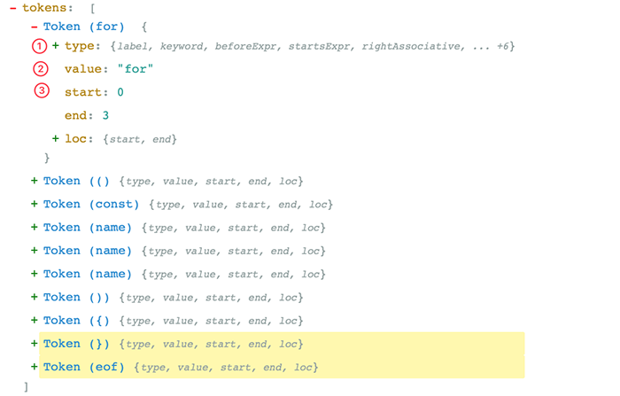
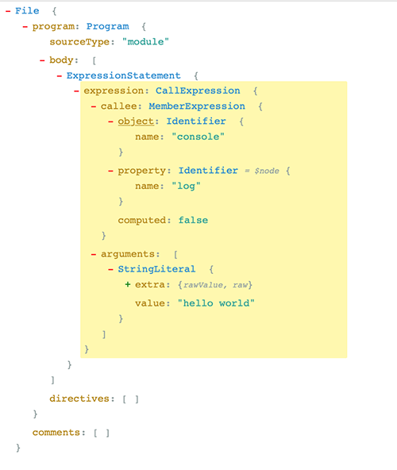

## Babel 工作流

上图是 `Babel` 的处理流程, 如果读者学习过**编译器原理**，这个过程就相当亲切了.

### Parsing

首先从源码 `解析(Parsing)` 开始，解析包含了两个步骤：

**1️⃣ 词法解析(Lexical Analysis)**： `词法解析器(Tokenizer)`在这个阶段将字符串形式的代码转换为`Tokens(令牌)`. Tokens 可以视作是一些语法片段组成的数组. 例如`for (const item of items) {}` 词法解析后的结果如下:

从上图可以看，每个 `Token` 中包含了语法片段、位置信息、以及一些类型信息. 这些信息有助于后续的语法分析。

**2️⃣语法解析(Syntactic Analysis)**：这个阶段语法`解析器(Parser)`会把`Tokens`转换为`抽象语法树(Abstract Syntax Tree，AST)`

**什么是AST**?

它就是一棵’对象树’，用来表示代码的语法结构，例如`console.log('hello world')`会解析成为:

`Program`、`CallExpression`、`Identifier` **这些都是节点的类型，每个节点都是一个有意义的语法单元**。 这些节点类型定义了一些属性来描述节点的信息。

JavaScript的语法越来越复杂，而且 Babel 除了支持最新的JavaScript规范语法, 还支持 `JSX`、`Flow`、现在还有`Typescript`。想象一下 AST 的节点类型有多少，其实我们不需要去记住这么多类型、也记不住. **插件开发者会利用 [`ASTExplorer`](https://astexplorer.net/) 来审查解析后的AST树**, 非常强大👍。

**AST 是 Babel 转译的核心数据结构，后续的操作都依赖于 AST**。

### Transform

接着就是**转换(Transform)**了，转换阶段会对 AST 进行遍历，在这个过程中对节点进行增删查改。Babel 所有插件都是在这个阶段工作, 比如语法转换、代码压缩。

### Generator

**Javascript In Javascript Out**, 最后阶段还是要把 AST 转换回字符串形式的Javascript，同时这个阶段还会生成Source Map。

