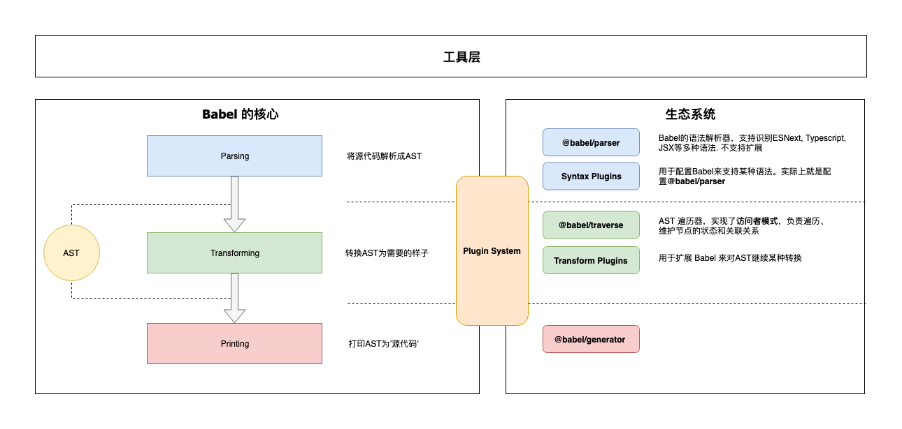
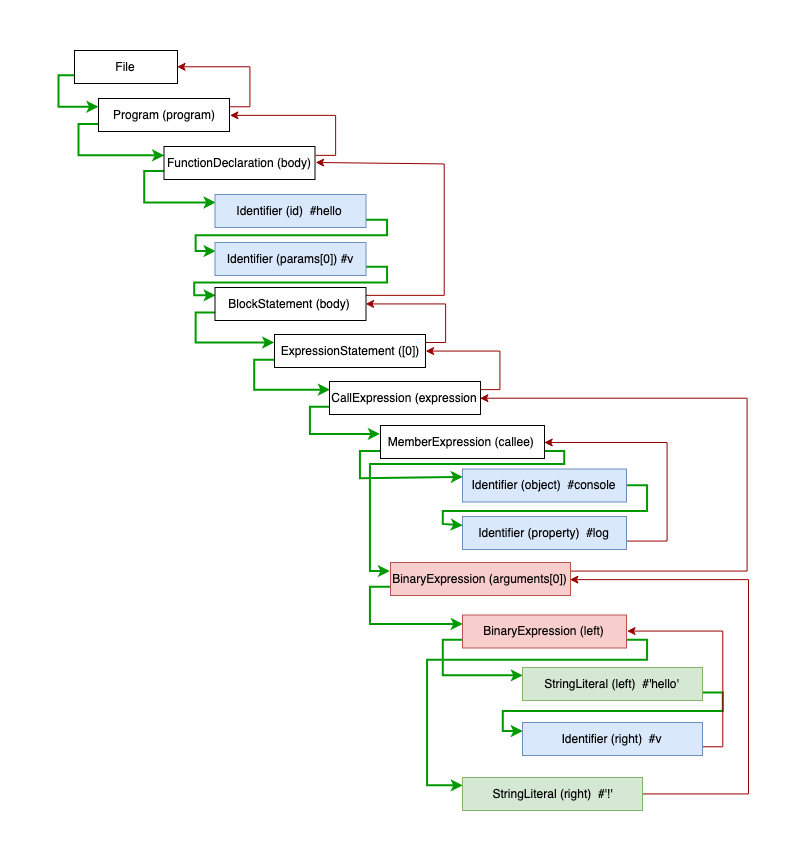
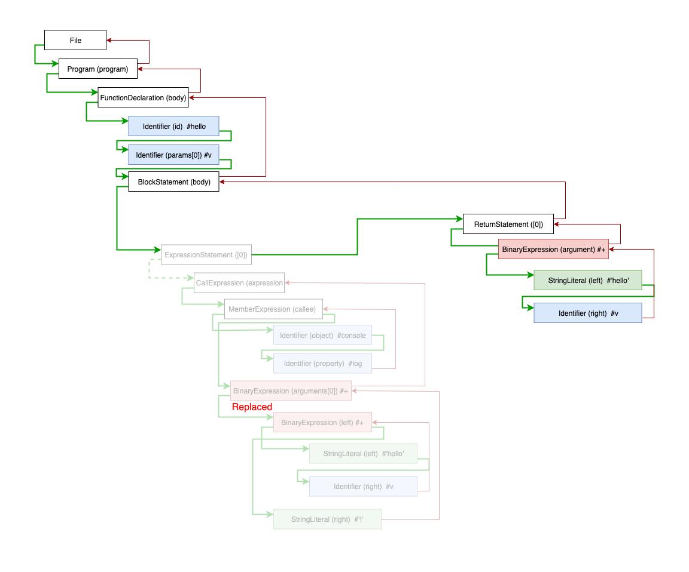
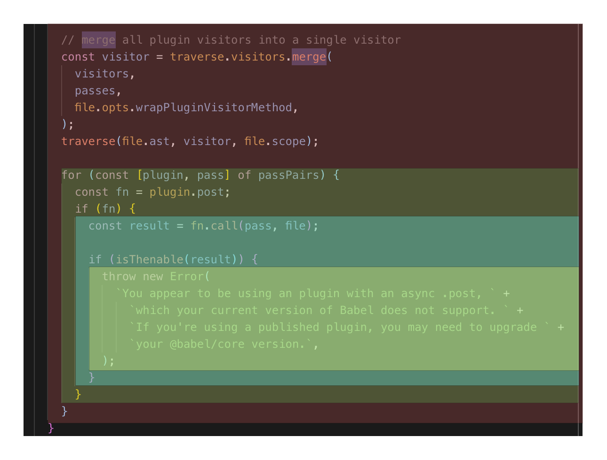
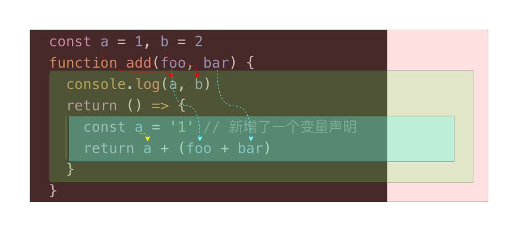
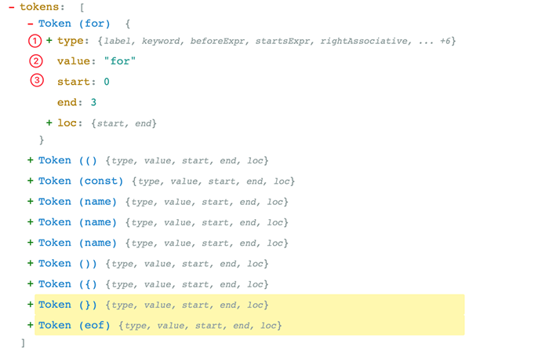
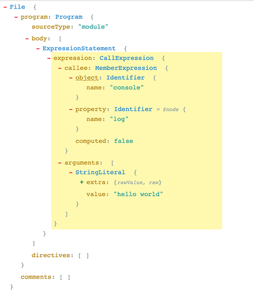

## Babel 架构

`Babel` 和 `Webpack` 为了适应复杂的定制需求和频繁的功能变化，都使用了[微内核](https://juejin.im/post/5d7ffad551882545ff173083#heading-10) 的架构风格。**也就是说它们的核心非常小，大部分功能都是通过插件扩展实现的**。

所以简单地了解一下 `Babel` 的架构和一些基本概念，对后续文章内容的理解, 以及`Babel`的使用还是有帮助的。



`Babel` 是一个 `MonoRepo` 项目， 不过组织非常清晰，下面就源码上我们能看到的模块进行一下分类， 配合上面的架构图让你对`Babel`有个大概的认识:

**1️⃣ 核心**:

`@babel/core` 这也是上面说的‘微内核’架构中的‘内核’。对于 `Babel` 来说，这个内核主要干这些事情：

+ 加载和处理配置(config)
+ 加载插件
+ 调用 `Parser` 进行语法解析，生成 `AST`
+ 调用 `Traverser` 遍历 `AST`，并使用`访问者模式`应用’插件’对 `AST` 进行转换
+ 生成代码，包括 `SourceMap` 转换和源代码生成

**2️⃣ 核心周边支撑**

+ **Parser(`@babel/parser`)**： 将源代码解析为 AST 就靠它了。 它已经内置支持很多语法. 例如 JSX、Typescript、Flow、以及最新的ECMAScript规范。目前为了执行效率，parser是[不支持扩展的](https://babeljs.io/docs/en/babel-parser#faq)，由官方进行维护。如果你要支持自定义语法，可以 fork 它，不过这种场景非常少。
+ **Traverser(`@babel/traverse`)**： 实现了`访问者模式`，对 AST 进行遍历，`转换插件`会通过它获取感兴趣的AST节点，对节点继续操作, 下文会详细介绍`访问器模式`。
+ **Generator(`@babel/generator`)**： 将 AST 转换为源代码，支持 SourceMap

**3️⃣ 插件**

打开 Babel 的源代码，会发现有好几种类型的‘插件’。

+ **语法插件(`@babel/plugin-syntax-\*`)**：上面说了 `@babel/parser` 已经支持了很多 JavaScript 语法特性，Parser也不支持扩展. **因此`plugin-syntax-\*`实际上只是用于开启或者配置Parser的某个功能特性**。

  一般用户不需要关心这个，Transform 插件里面已经包含了相关的`plugin-syntax-*`插件了。用户也可以通过[`parserOpts`](https://babeljs.io/docs/en/options#parseropts)配置项来直接配置 Parser

+ **转换插件**： 用于对 AST 进行转换, 实现转换为ES5代码、压缩、功能增强等目的. Babel仓库将转换插件划分为两种(只是命名上的区别)：

  + `@babel/plugin-transform-*`： 普通的转换插件
  + `@babel/plugin-proposal-*`： 还在’提议阶段’(非正式)的语言特性, 目前有[这些](https://babeljs.io/docs/en/next/plugins#experimental)

+ **预定义集合(`@babel/presets-\*`)**： 插件集合或者分组，主要方便用户对插件进行管理和使用。比如`preset-env`含括所有的标准的最新特性; 再比如`preset-react`含括所有react相关的插件.

**4️⃣ 插件开发辅助**

+ `@babel/template`： 某些场景直接操作AST太麻烦，就比如我们直接操作DOM一样，所以Babel实现了这么一个简单的模板引擎，可以将字符串代码转换为AST。比如在生成一些辅助代码(helper)时会用到这个库
+ `@babel/types`： AST 节点构造器和断言. 插件开发时使用很频繁
+ `@babel/helper-*`： 一些辅助器，用于辅助插件开发，例如简化AST操作
+ `@babel/helper`： 辅助代码，单纯的语法转换可能无法让代码运行起来，比如低版本浏览器无法识别class关键字，这时候需要添加辅助代码，对class进行模拟。

**5️⃣ 工具**

+ `@babel/node`： Node.js CLI, 通过它直接运行需要 Babel 处理的JavaScript文件
+ `@babel/register`： Patch NodeJs 的require方法，支持导入需要Babel处理的JavaScript模块
+ `@babel/cli`： CLI工具

**所以转换器操作 AST 一般都是使用`访问器模式`，由这个`访问者(Visitor)`来 **

+ **① 进行统一的遍历操作**
+ **② 提供节点的操作方法**
+ **③ 响应式维护节点之间的关系；**

**而插件(设计模式中称为‘具体访问者’)只需要定义自己感兴趣的节点类型，当访问者访问到对应节点时，就调用插件的访问(visit)方法**。

假设我们的代码如下:

```js
function hello(v) {
  console.log('hello' + v + '!')
}
```

解析后的 AST 结构如下:

```toml
File
  Program (program)
    FunctionDeclaration (body)
      Identifier (id)  #hello
      Identifier (params[0]) #v
      BlockStatement (body)
        ExpressionStatement ([0])
          CallExpression (expression)
            MemberExpression (callee)  #console.log
              Identifier (object)  #console
              Identifier (property)  #log
            BinaryExpression (arguments[0])
              BinaryExpression (left)
                StringLiteral (left)  #'hello'
                Identifier (right)  #v
              StringLiteral (right)  #'!'
```

访问者会以`深度优先`的顺序, 或者说递归地对 AST 进行遍历，其调用顺序如下图所示:



上图中`绿线`表示进入该节点，`红线`表示离开该节点。下面写一个超简单的’具体访问者’来还原上面的遍历过程:

```js
const babel = require('@babel/core')
const traverse = require('@babel/traverse').default

const ast = babel.parseSync(code)

let depth = 0
traverse(ast, {
  enter(path) {
    console.log(`enter ${path.type}(${path.key})`)
    depth++
  },
  exit(path) {
    depth--
    console.log(`  exit ${path.type}(${path.key})`)
  }
})
```

<table style="box-sizing: border-box; width: auto; font-size: 12px; border-collapse: collapse; text-align: left;"><tbody style="box-sizing: border-box;"><tr style="box-sizing: border-box;"><td class="code" style="box-sizing: border-box; border-bottom: none; padding: 0px 8px 0px;"><pre style="box-sizing: border-box; font-family: Menlo, &quot;Meslo LG&quot;, monospace; font-size: 13px; padding: 0px; line-height: 22px; border-radius: 4px; border: none; overflow-x: auto; hyphens: manual; background: none;"><span class="line" style="box-sizing: border-box; height: 22px;">enter Program(program)</span><br style="box-sizing: border-box;"><span class="line" style="box-sizing: border-box; height: 22px;">  enter FunctionDeclaration(0)</span><br style="box-sizing: border-box;"><span class="line" style="box-sizing: border-box; height: 22px;">    enter Identifier(id)</span><br style="box-sizing: border-box;"><span class="line" style="box-sizing: border-box; height: 22px;">    exit Identifier(id)</span><br style="box-sizing: border-box;"><span class="line" style="box-sizing: border-box; height: 22px;">    enter Identifier(0)</span><br style="box-sizing: border-box;"><span class="line" style="box-sizing: border-box; height: 22px;">    exit Identifier(0)</span><br style="box-sizing: border-box;"><span class="line" style="box-sizing: border-box; height: 22px;">    enter BlockStatement(body)</span><br style="box-sizing: border-box;"><span class="line" style="box-sizing: border-box; height: 22px;">      enter ExpressionStatement(0)</span><br style="box-sizing: border-box;"><span class="line" style="box-sizing: border-box; height: 22px;">        enter CallExpression(expression)</span><br style="box-sizing: border-box;"><span class="line" style="box-sizing: border-box; height: 22px;">          enter MemberExpression(callee)</span><br style="box-sizing: border-box;"><span class="line" style="box-sizing: border-box; height: 22px;">            enter Identifier(object)</span><br style="box-sizing: border-box;"><span class="line" style="box-sizing: border-box; height: 22px;">            exit Identifier(object)</span><br style="box-sizing: border-box;"><span class="line" style="box-sizing: border-box; height: 22px;">            enter Identifier(property)</span><br style="box-sizing: border-box;"><span class="line" style="box-sizing: border-box; height: 22px;">            exit Identifier(property)</span><br style="box-sizing: border-box;"><span class="line" style="box-sizing: border-box; height: 22px;">          exit MemberExpression(callee)</span><br style="box-sizing: border-box;"><span class="line" style="box-sizing: border-box; height: 22px;">          enter BinaryExpression(0)</span><br style="box-sizing: border-box;"><span class="line" style="box-sizing: border-box; height: 22px;">            enter BinaryExpression(left)</span><br style="box-sizing: border-box;"><span class="line" style="box-sizing: border-box; height: 22px;">              enter StringLiteral(left)</span><br style="box-sizing: border-box;"><span class="line" style="box-sizing: border-box; height: 22px;">              exit StringLiteral(left)</span><br style="box-sizing: border-box;"><span class="line" style="box-sizing: border-box; height: 22px;">              enter Identifier(right)</span><br style="box-sizing: border-box;"><span class="line" style="box-sizing: border-box; height: 22px;">              exit Identifier(right)</span><br style="box-sizing: border-box;"><span class="line" style="box-sizing: border-box; height: 22px;">            exit BinaryExpression(left)</span><br style="box-sizing: border-box;"><span class="line" style="box-sizing: border-box; height: 22px;">            enter StringLiteral(right)</span><br style="box-sizing: border-box;"><span class="line" style="box-sizing: border-box; height: 22px;">            exit StringLiteral(right)</span><br style="box-sizing: border-box;"><span class="line" style="box-sizing: border-box; height: 22px;">          exit BinaryExpression(0)</span><br style="box-sizing: border-box;"><span class="line" style="box-sizing: border-box; height: 22px;">        exit CallExpression(expression)</span><br style="box-sizing: border-box;"><span class="line" style="box-sizing: border-box; height: 22px;">      exit ExpressionStatement(0)</span><br style="box-sizing: border-box;"><span class="line" style="box-sizing: border-box; height: 22px;">    exit BlockStatement(body)</span><br style="box-sizing: border-box;"><span class="line" style="box-sizing: border-box; height: 22px;">  exit FunctionDeclaration(0)</span><br style="box-sizing: border-box;"><span class="line" style="box-sizing: border-box; height: 22px;">exit Program(program)</span><br style="box-sizing: border-box;"></pre></td></tr></tbody></table>

当访问者进入一个节点时就会调用 `enter(进入)` 方法，反之离开该节点时会调用 `exit(离开)` 方法。 一般情况下，插件不会直接使用`enter`方法，只会关注少数几个节点类型，所以具体访问者也可以这样声明访问方法:

```js
traverse(ast, {
  // 访问标识符
  Identifier(path) {
    console.log(`enter Identifier`)
  },
  // 访问调用表达式
  CallExpression(path) {
    console.log(`enter CallExpression`)
  },
  // 上面是enter的简写，如果要处理exit，也可以这样
  // 二元操作符
  BinaryExpression: {
    enter(path) {},
    exit(path) {},
  },
  // 更高级的, 使用同一个方法访问多种类型的节点
  "ExportNamedDeclaration|Flow"(path) {}
})
```

**那么 Babel 插件是怎么被应用的呢？**

Babel 会按照插件定义的顺序来应用访问方法，比如你注册了多个插件，babel-core 最后传递给访问器的数据结构大概长这样：

```js
{
  Identifier: {
    enter: [plugin-xx, plugin-yy,] // 数组形式
  }
}
```

当进入一个节点时，这些插件会按照注册的顺序被执行。大部分插件是不需要开发者关心定义的顺序的，有少数的情况需要稍微注意以下，例如`plugin-proposal-decorators`:

```js
{
  "plugins": [
    "@babel/plugin-proposal-decorators",     // 必须在plugin-proposal-class-properties之前
    "@babel/plugin-proposal-class-properties"
  ]
}
```

所有插件定义的顺序，按照惯例，应该是新的或者说实验性的插件在前面，老的插件定义在后面。因为可能需要新的插件将 AST 转换后，老的插件才能识别语法（向后兼容）。下面是官方配置例子, 为了确保先后兼容，`stage-*`阶段的插件先执行:

```js
{
  "presets": ["es2015", "react", "stage-2"]
}
```

### 节点的上下文

访问者在访问一个节点时, 会无差别地调用 `enter` 方法，我们怎么知道这个节点在什么位置以及和其他节点的关联关系呢？

通过上面的代码，读者应该可以猜出几分，每个`visit`方法都接收一个 `Path` 对象, 你可以将它当做一个‘上下文’对象，类似于`JQuery`的 `JQuery`(`const $el = $('.el')`) 对象，这里面包含了很多信息：

+ 当前节点信息
+ 节点的关联信息。父节点、子节点、兄弟节点等等
+ 作用域信息
+ 上下文信息
+ 节点操作方法。节点增删查改
+ 断言方法。isXXX, assertXXX

下面是它的主要结构:

```
export class NodePath<T = Node> {
    constructor(hub: Hub, parent: Node);
    parent: Node;
    hub: Hub;
    contexts: TraversalContext[];
    data: object;
    shouldSkip: boolean;
    shouldStop: boolean;
    removed: boolean;
    state: any;
    opts: object;
    skipKeys: object;
    parentPath: NodePath;
    context: TraversalContext;
    container: object | object[];
    listKey: string; // 如果节点在一个数组中，这个就是节点数组的键
    inList: boolean;
    parentKey: string;
    key: string | number; // 节点所在的键或索引
    node: T;  // 🔴 当前节点
    scope: Scope; // 🔴当前节点所在的作用域
    type: T extends undefined | null ? string | null : string; // 🔴节点类型
    typeAnnotation: object;
    // ... 还有很多方法，实现增删查改
}
```

你可以通过这个[手册](https://github.com/jamiebuilds/babel-handbook/blob/master/translations/zh-Hans/plugin-handbook.md#toc-visitors)来学习怎么通过 Path 来转换 AST. 后面也会有代码示例，这里就不展开细节了


### 副作用的处理

实际上访问者的工作比我们想象的要复杂的多，上面示范的是静态 AST 的遍历过程。而 AST 转换本身是有副作用的，比如插件将旧的节点替换了，那么访问者就没有必要再向下访问旧节点了，而是继续访问新的节点, 代码如下。

```
traverse(ast, {
  ExpressionStatement(path) {
    // 将 `console.log('hello' + v + '!')` 替换为 `return ‘hello’ + v`
    const rtn = t.returnStatement(t.binaryExpression('+', t.stringLiteral('hello'), t.identifier('v')))
    path.replaceWith(rtn)
  },
}
```


上面的代码, 将`console.log('hello' + v + '!')`语句替换为`return "hello" + v;`, 下图是遍历的过程：




我们可以对 AST 进行任意的操作，比如删除父节点的兄弟节点、删除第一个子节点、新增兄弟节点… **当这些操作’污染’了 AST 树后，访问者需要记录这些状态，响应式(Reactive)更新 Path 对象的关联关系, 保证正确的遍历顺序，从而获得正确的转译结果**。


### 作用域的处理

访问者可以确保正确地遍历和修改节点，但是对于转换器来说，另一个比较棘手的是对作用域的处理，这个责任落在了插件开发者的头上。插件开发者必须非常谨慎地处理作用域，不能破坏现有代码的执行逻辑。

```js
const a = 1, b = 2
function add(foo, bar) {
  console.log(a, b)
  return foo + bar
}
```

比如你要将 `add` 函数的第一个参数 `foo` 标识符修改为`a`, 你就需要**递归**遍历子树，查出`foo`标识符的所有`引用`, 然后替换它:

```js
traverse(ast, {
  // 将第一个参数名转换为a
  FunctionDeclaration(path) {
    const firstParams = path.get('params.0')
    if (firstParams == null) {
      return
    }

    const name = firstParams.node.name
    // 递归遍历，这是插件常用的模式。这样可以避免影响到外部作用域
    path.traverse({
      Identifier(path) {
        if (path.node.name === name) {
          path.replaceWith(t.identifier('a'))
        }
      }
    })
  },
})

console.log(generate(ast).code)
// function add(a, bar) {
//   console.log(a, b);
//   return a + bar;
// }
```

🤯慢着，好像没那么简单，替换成 `a` 之后, `console.log(a, b)` 的行为就被破坏了。所以这里不能用 `a`，得换个标识符, 譬如`c`.

这就是转换器需要考虑的作用域问题，**AST 转换的前提是保证程序的正确性**。 我们在添加和修改`引用`时，需要确保与现有的所有引用不冲突。Babel本身不能检测这类异常，只能依靠插件开发者谨慎处理。

Javascript采用的是词法作用域, 也就是根据源代码的词法结构来确定作用域：



在**词法区块(block)**中，由于新建变量、函数、类、函数参数等创建的标识符，都属于这个区块作用域. 这些标识符也称为**绑定(Binding)**，而对这些绑定的使用称为**引用(Reference)**

在Babel中，使用`Scope`对象来表示作用域。 我们可以通过Path对象的`scope`字段来获取当前节点的`Scope`对象。它的结构如下:

```js
{
  path: NodePath;
  block: Node;         // 所属的词法区块节点, 例如函数节点、条件语句节点
  parentBlock: Node;   // 所属的父级词法区块节点
  parent: Scope;       // ⚛️指向父作用域
  bindings: { [name: string]: Binding; }; // ⚛️ 该作用域下面的所有绑定(即该作用域创建的标识符)
}
```

`Scope` 对象和 `Path` 对象差不多，**它包含了作用域之间的关联关系(通过parent指向父作用域)，收集了作用域下面的所有绑定(bindings), 另外还提供了丰富的方法来对作用域仅限操作**。

我们可以通过`bindings`属性获取当前作用域下的所有绑定(即标识符)，每个绑定由`Binding`类来表示：

```js
export class Binding {
  identifier: t.Identifier;
  scope: Scope;
  path: NodePath;
  kind: "var" | "let" | "const" | "module";
  referenced: boolean;
  references: number;              // 被引用的数量
  referencePaths: NodePath[];      // ⚛️获取所有应用该标识符的节点路径
  constant: boolean;               // 是否是常量
  constantViolations: NodePath[];
}
```

**通过`Binding`对象我们可以确定标识符被引用的情况**。

Ok，有了 `Scope` 和 `Binding`, 现在有能力实现安全的变量重命名转换了。 为了更好地展示作用域交互，在上面代码的基础上，我们再增加一下难度：

```js
const a = 1, b = 2
function add(foo, bar) {
  console.log(a, b)
  return () => {
    const a = '1' // 新增了一个变量声明
    return a + (foo + bar)
  }
}
```

现在你要重命名函数参数 `foo`, 不仅要考虑`外部的作用域`, 也要考虑`下级作用域`的绑定情况，确保这两者都不冲突。

上面的代码作用域和标识符引用情况如下图所示:




来吧，接受挑战，试着将函数的第一个参数重新命名为更短的标识符:

```js
// 用于获取唯一的标识符
const getUid = () => {
  let uid = 0
  return () => `_${(uid++) || ''}`
}

const ast = babel.parseSync(code)
traverse(ast, {
  FunctionDeclaration(path) {
    // 获取第一个参数
    const firstParam = path.get('params.0')
    if (firstParam == null) {
      return
    }

    const currentName = firstParam.node.name
    const currentBinding = path.scope.getBinding(currentName)
    const gid = getUid()
    let sname

    // 循环找出没有被占用的变量名
    while(true) {
      sname = gid()

      // 1️⃣首先看一下父作用域是否已定义了该变量
      if (path.scope.parentHasBinding(sname)) {
        continue
      }

      // 2️⃣ 检查当前作用域是否定义了变量
      if (path.scope.hasOwnBinding(sname)) {
        // 已占用
        continue
      }

      //  再检查第一个参数的当前的引用情况,
      // 如果它所在的作用域定义了同名的变量，我们也得放弃
      if (currentBinding.references > 0) {
        let findIt = false
        for (const refNode of currentBinding.referencePaths) {
          if (refNode.scope !== path.scope && refNode.scope.hasBinding(sname)) {
            findIt = true
            break
          }
        }
        if (findIt) {
          continue
        }
      }
      break
    }

    // 开始替换掉
    const i = t.identifier(sname)
    currentBinding.referencePaths.forEach(p => p.replaceWith(i))
    firstParam.replaceWith(i)
  },
})

console.log(generate(ast).code)
// const a = 1,
//       b = 2;

// function add(_, bar) {
//   console.log(a, b);
//   return () => {
//     const a = '1'; // 新增了一个变量声明

//     return a + (_ + bar);
//   };
// }
```

上面的例子虽然没有什么实用性，而且还有Bug(没考虑`label`)，但是正好可以揭示了作用域处理的复杂性。

Babel的 `Scope` 对象其实提供了一个`generateUid`方法来生成唯一的、不冲突的标识符。我们利用这个方法再简化一下我们的代码:

```js
traverse(ast, {
  FunctionDeclaration(path) {
    const firstParam = path.get('params.0')
    if (firstParam == null) {
      return
    }
    let i = path.scope.generateUidIdentifier('_') // 也可以使用generateUid
    const currentBinding = path.scope.getBinding(firstParam.node.name)
    currentBinding.referencePaths.forEach(p => p.replaceWith(i))
    firstParam.replaceWith(i)
  },
})
```

能不能再短点!

```js
traverse(ast, {
  FunctionDeclaration(path) {
    const firstParam = path.get('params.0')
    if (firstParam == null) {
      return
    }
    let i = path.scope.generateUid('_') // 也可以使用generateUid
    path.scope.rename(firstParam.node.name, i)
  },
})
```

## Babel 工作流程


上图是 `Babel` 的处理流程, 如果读者学习过**编译器原理**，这个过程就相当亲切了.

### Parsing

首先从源码 `解析(Parsing)` 开始，解析包含了两个步骤：

**1️⃣ 词法解析(Lexical Analysis)**： `词法解析器(Tokenizer)`在这个阶段将字符串形式的代码转换为`Tokens(令牌)`. Tokens 可以视作是一些语法片段组成的数组. 例如`for (const item of items) {}` 词法解析后的结果如下:



从上图可以看，每个 `Token` 中包含了语法片段、位置信息、以及一些类型信息. 这些信息有助于后续的语法分析。

**2️⃣语法解析(Syntactic Analysis)**：这个阶段语法`解析器(Parser)`会把`Tokens`转换为`抽象语法树(Abstract Syntax Tree，AST)`

**什么是AST**?

它就是一棵’对象树’，用来表示代码的语法结构，例如`console.log('hello world')`会解析成为:



`Program`、`CallExpression`、`Identifier` **这些都是节点的类型，每个节点都是一个有意义的语法单元**。 这些节点类型定义了一些属性来描述节点的信息。

JavaScript的语法越来越复杂，而且 Babel 除了支持最新的JavaScript规范语法, 还支持 `JSX`、`Flow`、现在还有`Typescript`。想象一下 AST 的节点类型有多少，其实我们不需要去记住这么多类型、也记不住. **插件开发者会利用 [`ASTExplorer`](https://astexplorer.net/) 来审查解析后的AST树**, 非常强大👍。

**AST 是 Babel 转译的核心数据结构，后续的操作都依赖于 AST**。

### Transform

接着就是**转换(Transform)**了，转换阶段会对 AST 进行遍历，在这个过程中对节点进行增删查改。Babel 所有插件都是在这个阶段工作, 比如语法转换、代码压缩。

### Generator

**Javascript In Javascript Out**, 最后阶段还是要把 AST 转换回字符串形式的Javascript，同时这个阶段还会生成Source Map。

