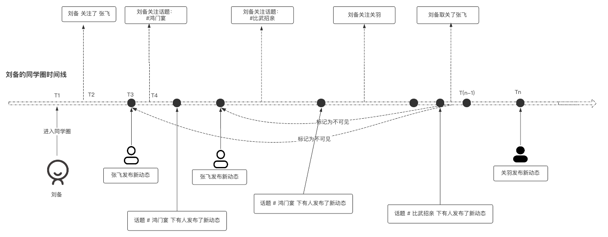

# [同学圈关注列表时间线设计方案](http://wiki.baidu.com/pages/viewpage.action?pageId=1380902923)

[转至元数据结尾](http://wiki.baidu.com/pages/viewpage.action?pageId=1380902923#page-metadata-end)

- 由 [王琦](http://wiki.baidu.com/display/~wangqi49)创建, 最后修改于[2021-03-18](http://wiki.baidu.com/pages/diffpagesbyversion.action?pageId=1380902923&selectedPageVersions=8&selectedPageVersions=9)

[转至元数据起始](http://wiki.baidu.com/pages/viewpage.action?pageId=1380902923#page-metadata-start)

### 背景

朋友圈首页关注列表（这里一期只获取用户关注的好友、话题下新增的动态（moment）内容数据列表）。

传统的思路：" 先查询我的关注，在根据我的关注查询他们的动态" 这个存在很大的问题。 一方面查询会非常复杂，性能问题肯定会成为瓶颈。另一方面，后续在扩展相册、视频册等功能，这里将很难维护，会变得越来越复杂，以至于难以维护。

### 引入『时间线』思想

参考微信朋友圈的底层实现架构设计思想 ： **刷朋友圈，即刷时间线。**

### 什么是时间线

每个用户会有一条自己的时间线，当我关注的人 / 话题 / 相册下有新内容时，会在我的**时间线上插入一个动态的索引，**同样的如果我取关了一个人/取关了一个话题，需要更新这个人/话题在我的时间线上所有的动态设置为**不可见状态。**

如此一来，

### 用户刘备的时间线示意图

### 优缺点分析

**缺点：**

在这个过程中，发布是很重的，因为一方面要写一个自己的数据副本，然后还要把这个副本的指针插到所有好友的时间线里面去。

如果一个用户有几百个好友的话，这个过程会比较慢一些。这是一个单数据副本写扩散的过程。但是相对应的，读取就很简单了，每一个用户只需要读取自己的时间线表，就这一个动作就行，而不需要去遍历所有好友的动态表。

**优点：**
本质上我们选择了一个写扩散的模型，因为读的失败情况很多，会影响到业务、用户体验的。

一个用户如果要去读两百个好友的动态表，极端情况下可能要去查询好几个关联的服务，这个失败的可能性是很大的。但是写失败了就没关系，因为写是可以等待的，写失败了就重新去拷贝，直到插入成功为止。所以这样一个模型可以很大的减少服务的开销。

### 风险

因为时间线都是以用户为维度的，每个用户都有一条自己的时间线。即数据库层面，每个用户都需要记录其好友的动态索引、关注话题下的动态索引等数据，虽然单条数据很小，但是量增长会很快，后期MySQL的容量、查询性能或许会成为瓶颈。如果采用时间线的方案，则需要为后期的分库分表做好准备。

###  具体的实现细节

查询：Redis读

插入：MySQL + Redis双写

### 关注动态时间线缓存在哪些情况下需要进行更新？

1. 发布成功，增加粉丝时间线动态数据
2. 删除成功，删除粉丝时间线动态数据
3. 话题下发动态，增加话题粉丝时间线动态数据
4. 话题下删动态，删除话题粉丝时间线动态数据