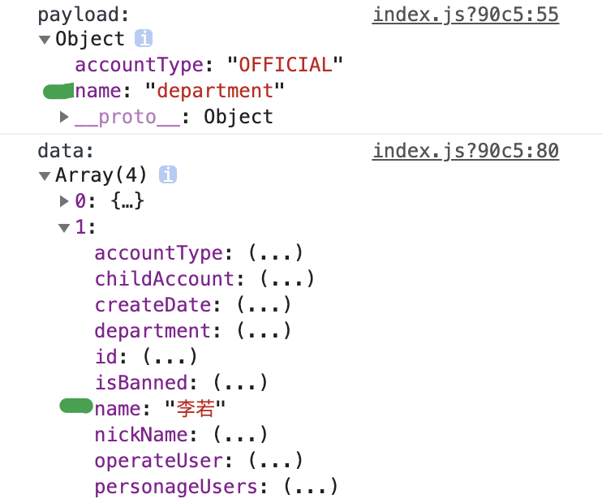

```ts
// 周平均访问次数分布曲线
[{
  firstDayOfWeek: '2020.01.01',
  viewCount: 1200,
}, {...}, {...}]


// 用户访问时间分布曲线
[{
  viewTime: timestamp
  userCount: 1200,
}, {...}, {...}]


```


## /tongxue/admin/user/searchTongXueUsers

------

`name`(业务方名称没生效)；



查询禁言用户的操作人需要拼接缺少姓名字段

还有官方用户的创建人